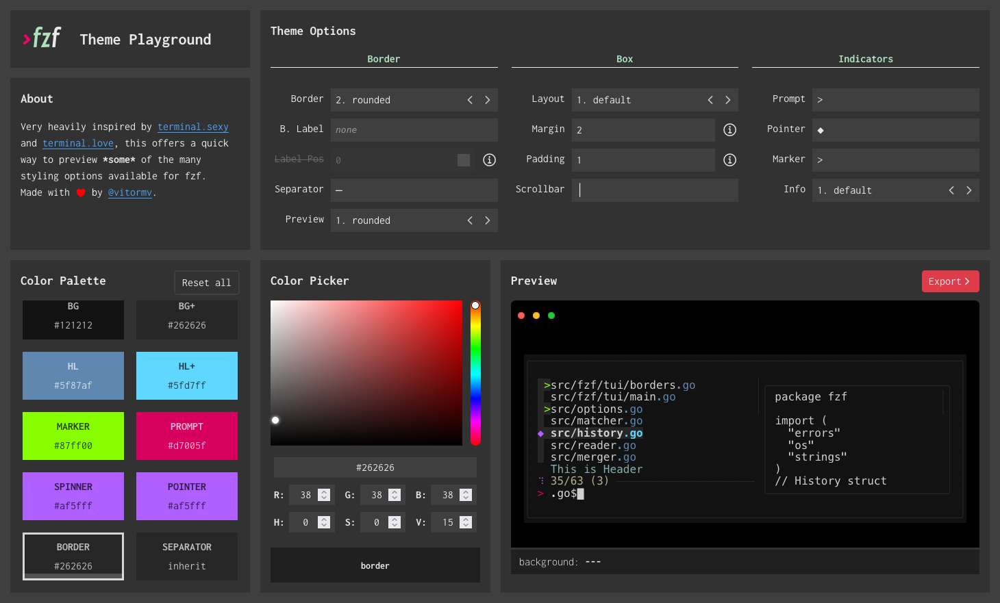

# fzf Theme Playground

This tool allows you to quickly preview and tweak `fzf` some of the many options available,
to make it look just the way you like it.

Made with Svelte.

## Export

You can either export your options/colors to an `FZF_DEFAULT_OPTS` variable for your `.bashrc`, or
share it with others through a url hash permalink.

## Known limitations

This tool is meant to be a way to quickly preview `fzf` colors and settings, therefore
not **all** options are supported. Some are quite hard to implement, or there is no point in recreating
them here as the visual difference is minimal (e.g. margin/padding percentages). When you doubt, always consult `man fzf` for details! Some known unsupported features are:

- margin/padding percentages
- inline "info" options are missing
- border top/bottom/left/right
- and many more!

Some of these might be added in the future when I have time, but PRs are also welcome.
